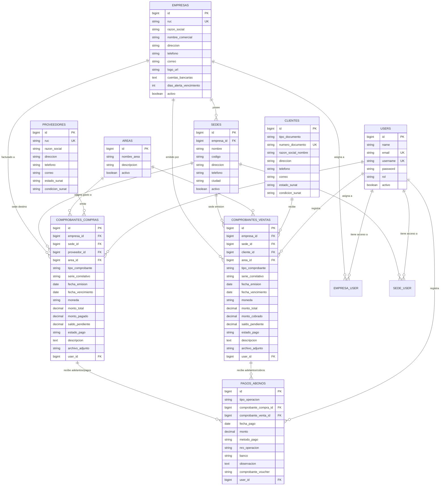

# 🗄️ 03. Modelo de Datos y Script SQL (Multi-Empresa & Multi-Sede)

## 1. Diagrama Entidad-Relación (DER)



---

## 2. Diccionario de Datos

### 2.1 Tabla: `empresas` (Razones Sociales)
| Campo | Tipo | Nulo | Descripción |
| :--- | :--- | :--- | :--- |
| `id` | `BIGINT UNSIGNED AUTO_INCREMENT` | NO | Clave primaria. |
| `ruc` | `VARCHAR(11)` | NO | RUC de 11 dígitos de la empresa (Único). |
| `razon_social` | `VARCHAR(255)` | NO | Nombre fiscal oficial. |
| `nombre_comercial`| `VARCHAR(255)`| SÍ | Nombre comercial de la empresa. |
| `direccion` | `VARCHAR(255)` | SÍ | Dirección fiscal de la empresa. |
| `telefono` | `VARCHAR(50)` | SÍ | Teléfono central. |
| `correo` | `VARCHAR(150)` | SÍ | Correo corporativo. |
| `logo_url` | `VARCHAR(255)` | SÍ | Ruta al archivo del logo para membretes. |
| `cuentas_bancarias`| `TEXT` | SÍ | JSON / Texto con cuentas BCP, BBVA, Yape para mensajes de cobro. |
| `dias_alerta_vencimiento`| `INT` | NO | Días antes para activar semáforo amarillo (Default: 5). |
| `activo` | `BOOLEAN` | NO | Estado de la empresa (Default: `true`). |

---

### 2.2 Tabla: `sedes` (Sucursales por Empresa)
| Campo | Tipo | Nulo | Descripción |
| :--- | :--- | :--- | :--- |
| `id` | `BIGINT UNSIGNED AUTO_INCREMENT` | NO | Clave primaria. |
| `empresa_id` | `BIGINT UNSIGNED` | NO | FK hacia `empresas.id`. |
| `nombre` | `VARCHAR(150)` | NO | Sede Principal, Taller Norte, etc. |
| `codigo` | `VARCHAR(20)` | SÍ | Código interno (ej: `SED-01`). |
| `direccion` | `VARCHAR(255)` | SÍ | Dirección física de la sucursal. |
| `telefono` | `VARCHAR(50)` | SÍ | Teléfono de la sede. |
| `ciudad` | `VARCHAR(100)` | SÍ | Ciudad/Distrito. |
| `activo` | `BOOLEAN` | NO | Default: `true`. |

---

### 2.3 Tablas Pivot: `empresa_user` y `sede_user`
Permiten asignar a los usuarios el acceso a una, varias o todas las empresas y sedes.

---

### 2.4 Tabla: `comprobantes_compras` (CxP Proveedores)
Incluye `empresa_id` y `sede_id` para garantizar el aislamiento por razón social y sucursal.

---

### 2.5 Tabla: `comprobantes_ventas` (CxC Clientes)
Incluye `empresa_id` y `sede_id` para que cada empresa emita sus comprobantes y controle sus cobranzas.

---

## 3. Script SQL DDL Completo (MySQL / MariaDB / Laravel)

```sql
-- ============================================================================
-- SCRIPT DDL: MSA FACTURACIÓN (LARAVEL 11 MULTI-EMPRESA & MULTI-SEDE)
-- ============================================================================

CREATE DATABASE IF NOT EXISTS `msa_facturacion_db`
CHARACTER SET utf8mb4 
COLLATE utf8mb4_spanish_ci;

USE `msa_facturacion_db`;

-- 1. Tabla de Empresas (Razones Sociales)
CREATE TABLE IF NOT EXISTS `empresas` (
    `id` BIGINT UNSIGNED AUTO_INCREMENT PRIMARY KEY,
    `ruc` VARCHAR(11) NOT NULL UNIQUE,
    `razon_social` VARCHAR(255) NOT NULL,
    `nombre_comercial` VARCHAR(255) NULL,
    `direccion` VARCHAR(255) NULL,
    `telefono` VARCHAR(50) NULL,
    `correo` VARCHAR(150) NULL,
    `logo_url` VARCHAR(255) NULL,
    `cuentas_bancarias` TEXT NULL,
    `dias_alerta_vencimiento` INT NOT NULL DEFAULT 5,
    `activo` BOOLEAN NOT NULL DEFAULT TRUE,
    `created_at` TIMESTAMP NULL DEFAULT NULL,
    `updated_at` TIMESTAMP NULL DEFAULT NULL
) ENGINE=InnoDB DEFAULT CHARSET=utf8mb4;

-- 2. Tabla de Sedes / Sucursales
CREATE TABLE IF NOT EXISTS `sedes` (
    `id` BIGINT UNSIGNED AUTO_INCREMENT PRIMARY KEY,
    `empresa_id` BIGINT UNSIGNED NOT NULL,
    `nombre` VARCHAR(150) NOT NULL,
    `codigo` VARCHAR(20) NULL,
    `direccion` VARCHAR(255) NULL,
    `telefono` VARCHAR(50) NULL,
    `ciudad` VARCHAR(100) NULL,
    `activo` BOOLEAN NOT NULL DEFAULT TRUE,
    `created_at` TIMESTAMP NULL DEFAULT NULL,
    `updated_at` TIMESTAMP NULL DEFAULT NULL,
    FOREIGN KEY (`empresa_id`) REFERENCES `empresas`(`id`) ON DELETE CASCADE ON UPDATE CASCADE,
    INDEX `idx_sede_empresa` (`empresa_id`)
) ENGINE=InnoDB DEFAULT CHARSET=utf8mb4;

-- 3. Tabla de Usuarios
CREATE TABLE IF NOT EXISTS `users` (
    `id` BIGINT UNSIGNED AUTO_INCREMENT PRIMARY KEY,
    `name` VARCHAR(150) NOT NULL,
    `email` VARCHAR(150) NOT NULL UNIQUE,
    `username` VARCHAR(50) NOT NULL UNIQUE,
    `password` VARCHAR(255) NOT NULL,
    `rol` ENUM('SUPERADMIN', 'ADMIN_EMPRESA', 'CONTADOR', 'ASISTENTE') NOT NULL DEFAULT 'CONTADOR',
    `activo` BOOLEAN NOT NULL DEFAULT TRUE,
    `remember_token` VARCHAR(100) NULL,
    `created_at` TIMESTAMP NULL DEFAULT NULL,
    `updated_at` TIMESTAMP NULL DEFAULT NULL
) ENGINE=InnoDB DEFAULT CHARSET=utf8mb4;

-- 4. Pivot: Acceso de Usuarios a Empresas
CREATE TABLE IF NOT EXISTS `empresa_user` (
    `id` BIGINT UNSIGNED AUTO_INCREMENT PRIMARY KEY,
    `user_id` BIGINT UNSIGNED NOT NULL,
    `empresa_id` BIGINT UNSIGNED NOT NULL,
    FOREIGN KEY (`user_id`) REFERENCES `users`(`id`) ON DELETE CASCADE,
    FOREIGN KEY (`empresa_id`) REFERENCES `empresas`(`id`) ON DELETE CASCADE,
    UNIQUE KEY `unique_empresa_user` (`user_id`, `empresa_id`)
) ENGINE=InnoDB DEFAULT CHARSET=utf8mb4;

-- 5. Pivot: Acceso de Usuarios a Sedes
CREATE TABLE IF NOT EXISTS `sede_user` (
    `id` BIGINT UNSIGNED AUTO_INCREMENT PRIMARY KEY,
    `user_id` BIGINT UNSIGNED NOT NULL,
    `sede_id` BIGINT UNSIGNED NOT NULL,
    FOREIGN KEY (`user_id`) REFERENCES `users`(`id`) ON DELETE CASCADE,
    FOREIGN KEY (`sede_id`) REFERENCES `sedes`(`id`) ON DELETE CASCADE,
    UNIQUE KEY `unique_sede_user` (`user_id`, `sede_id`)
) ENGINE=InnoDB DEFAULT CHARSET=utf8mb4;

-- 6. Tabla de Áreas / Centros de Costo
CREATE TABLE IF NOT EXISTS `areas` (
    `id` BIGINT UNSIGNED AUTO_INCREMENT PRIMARY KEY,
    `nombre_area` VARCHAR(100) NOT NULL UNIQUE,
    `descripcion` VARCHAR(255) NULL,
    `activo` BOOLEAN NOT NULL DEFAULT TRUE,
    `created_at` TIMESTAMP NULL DEFAULT NULL,
    `updated_at` TIMESTAMP NULL DEFAULT NULL
) ENGINE=InnoDB DEFAULT CHARSET=utf8mb4;

-- 7. Tabla de Proveedores (Cuentas por Pagar)
CREATE TABLE IF NOT EXISTS `proveedores` (
    `id` BIGINT UNSIGNED AUTO_INCREMENT PRIMARY KEY,
    `ruc` VARCHAR(11) NOT NULL UNIQUE,
    `razon_social` VARCHAR(255) NOT NULL,
    `direccion` VARCHAR(255) NULL,
    `telefono` VARCHAR(50) NULL,
    `correo` VARCHAR(150) NULL,
    `estado_sunat` VARCHAR(50) DEFAULT 'ACTIVO',
    `condicion_sunat` VARCHAR(50) DEFAULT 'HABIDO',
    `created_at` TIMESTAMP NULL DEFAULT NULL,
    `updated_at` TIMESTAMP NULL DEFAULT NULL,
    INDEX `idx_prov_ruc` (`ruc`),
    INDEX `idx_prov_razon` (`razon_social`)
) ENGINE=InnoDB DEFAULT CHARSET=utf8mb4;

-- 8. Tabla de Clientes (Cuentas por Cobrar)
CREATE TABLE IF NOT EXISTS `clientes` (
    `id` BIGINT UNSIGNED AUTO_INCREMENT PRIMARY KEY,
    `tipo_documento` ENUM('RUC', 'DNI', 'CE', 'PASAPORTE') NOT NULL DEFAULT 'RUC',
    `numero_documento` VARCHAR(20) NOT NULL UNIQUE,
    `razon_social_nombre` VARCHAR(255) NOT NULL,
    `direccion` VARCHAR(255) NULL,
    `telefono` VARCHAR(50) NULL,
    `correo` VARCHAR(150) NULL,
    `estado_sunat` VARCHAR(50) DEFAULT 'ACTIVO',
    `condicion_sunat` VARCHAR(50) DEFAULT 'HABIDO',
    `created_at` TIMESTAMP NULL DEFAULT NULL,
    `updated_at` TIMESTAMP NULL DEFAULT NULL,
    INDEX `idx_cli_doc` (`numero_documento`),
    INDEX `idx_cli_nombre` (`razon_social_nombre`)
) ENGINE=InnoDB DEFAULT CHARSET=utf8mb4;

-- 9. Tabla de Comprobantes de Compras (Proveedores - CxP)
CREATE TABLE IF NOT EXISTS `comprobantes_compras` (
    `id` BIGINT UNSIGNED AUTO_INCREMENT PRIMARY KEY,
    `empresa_id` BIGINT UNSIGNED NOT NULL,
    `sede_id` BIGINT UNSIGNED NOT NULL,
    `proveedor_id` BIGINT UNSIGNED NOT NULL,
    `area_id` BIGINT UNSIGNED NOT NULL,
    `tipo_comprobante` ENUM('FACTURA', 'BOLETA', 'RECIBO_HONORARIOS', 'NOTA_VENTA', 'OTRO') NOT NULL DEFAULT 'FACTURA',
    `serie_correlativo` VARCHAR(50) NOT NULL,
    `fecha_emision` DATE NOT NULL,
    `fecha_vencimiento` DATE NOT NULL,
    `moneda` ENUM('PEN', 'USD') NOT NULL DEFAULT 'PEN',
    `monto_total` DECIMAL(12,2) NOT NULL DEFAULT 0.00,
    `monto_pagado` DECIMAL(12,2) NOT NULL DEFAULT 0.00,
    `saldo_pendiente` DECIMAL(12,2) NOT NULL DEFAULT 0.00,
    `estado_pago` ENUM('PENDIENTE', 'CON_ADELANTO', 'PAGADO', 'ANULADO') NOT NULL DEFAULT 'PENDIENTE',
    `descripcion` TEXT NULL,
    `archivo_adjunto` VARCHAR(255) NULL,
    `user_id` BIGINT UNSIGNED NOT NULL,
    `created_at` TIMESTAMP NULL DEFAULT NULL,
    `updated_at` TIMESTAMP NULL DEFAULT NULL,
    FOREIGN KEY (`empresa_id`) REFERENCES `empresas`(`id`) ON DELETE RESTRICT ON UPDATE CASCADE,
    FOREIGN KEY (`sede_id`) REFERENCES `sedes`(`id`) ON DELETE RESTRICT ON UPDATE CASCADE,
    FOREIGN KEY (`proveedor_id`) REFERENCES `proveedores`(`id`) ON DELETE RESTRICT ON UPDATE CASCADE,
    FOREIGN KEY (`area_id`) REFERENCES `areas`(`id`) ON DELETE RESTRICT ON UPDATE CASCADE,
    FOREIGN KEY (`user_id`) REFERENCES `users`(`id`) ON DELETE RESTRICT ON UPDATE CASCADE,
    INDEX `idx_comp_empresa` (`empresa_id`),
    INDEX `idx_comp_sede` (`sede_id`),
    INDEX `idx_comp_venc` (`fecha_vencimiento`),
    INDEX `idx_comp_estado` (`estado_pago`)
) ENGINE=InnoDB DEFAULT CHARSET=utf8mb4;

-- 10. Tabla de Comprobantes de Ventas (Clientes - CxC)
CREATE TABLE IF NOT EXISTS `comprobantes_ventas` (
    `id` BIGINT UNSIGNED AUTO_INCREMENT PRIMARY KEY,
    `empresa_id` BIGINT UNSIGNED NOT NULL,
    `sede_id` BIGINT UNSIGNED NOT NULL,
    `cliente_id` BIGINT UNSIGNED NOT NULL,
    `area_id` BIGINT UNSIGNED NOT NULL,
    `tipo_comprobante` ENUM('FACTURA', 'BOLETA', 'COTIZACION', 'NOTA_VENTA', 'OTRO') NOT NULL DEFAULT 'FACTURA',
    `serie_correlativo` VARCHAR(50) NOT NULL,
    `fecha_emision` DATE NOT NULL,
    `fecha_vencimiento` DATE NOT NULL,
    `moneda` ENUM('PEN', 'USD') NOT NULL DEFAULT 'PEN',
    `monto_total` DECIMAL(12,2) NOT NULL DEFAULT 0.00,
    `monto_cobrado` DECIMAL(12,2) NOT NULL DEFAULT 0.00,
    `saldo_pendiente` DECIMAL(12,2) NOT NULL DEFAULT 0.00,
    `estado_pago` ENUM('PENDIENTE', 'CON_ADELANTO', 'PAGADO', 'ANULADO') NOT NULL DEFAULT 'PENDIENTE',
    `descripcion` TEXT NULL,
    `archivo_adjunto` VARCHAR(255) NULL,
    `user_id` BIGINT UNSIGNED NOT NULL,
    `created_at` TIMESTAMP NULL DEFAULT NULL,
    `updated_at` TIMESTAMP NULL DEFAULT NULL,
    FOREIGN KEY (`empresa_id`) REFERENCES `empresas`(`id`) ON DELETE RESTRICT ON UPDATE CASCADE,
    FOREIGN KEY (`sede_id`) REFERENCES `sedes`(`id`) ON DELETE RESTRICT ON UPDATE CASCADE,
    FOREIGN KEY (`cliente_id`) REFERENCES `clientes`(`id`) ON DELETE RESTRICT ON UPDATE CASCADE,
    FOREIGN KEY (`area_id`) REFERENCES `areas`(`id`) ON DELETE RESTRICT ON UPDATE CASCADE,
    FOREIGN KEY (`user_id`) REFERENCES `users`(`id`) ON DELETE RESTRICT ON UPDATE CASCADE,
    INDEX `idx_vent_empresa` (`empresa_id`),
    INDEX `idx_vent_sede` (`sede_id`),
    INDEX `idx_vent_venc` (`fecha_vencimiento`),
    INDEX `idx_vent_estado` (`estado_pago`)
) ENGINE=InnoDB DEFAULT CHARSET=utf8mb4;

-- 11. Tabla de Historial de Pagos / Abonos / Adelantos
CREATE TABLE IF NOT EXISTS `pagos_abonos` (
    `id` BIGINT UNSIGNED AUTO_INCREMENT PRIMARY KEY,
    `tipo_operacion` ENUM('COMPRA_PAGO', 'VENTA_COBRO') NOT NULL,
    `comprobante_compra_id` BIGINT UNSIGNED NULL,
    `comprobante_venta_id` BIGINT UNSIGNED NULL,
    `fecha_pago` DATE NOT NULL,
    `monto` DECIMAL(12,2) NOT NULL,
    `metodo_pago` ENUM('TRANSFERENCIA', 'EFECTIVO', 'YAPE', 'PLIN', 'DEPOSITO', 'CHEQUE', 'TARJETA', 'OTRO') NOT NULL DEFAULT 'TRANSFERENCIA',
    `nro_operacion` VARCHAR(100) NULL,
    `banco` VARCHAR(100) NULL,
    `comprobante_voucher` VARCHAR(255) NULL,
    `observacion` TEXT NULL,
    `user_id` BIGINT UNSIGNED NOT NULL,
    `created_at` TIMESTAMP NULL DEFAULT NULL,
    `updated_at` TIMESTAMP NULL DEFAULT NULL,
    FOREIGN KEY (`comprobante_compra_id`) REFERENCES `comprobantes_compras`(`id`) ON DELETE CASCADE,
    FOREIGN KEY (`comprobante_venta_id`) REFERENCES `comprobantes_ventas`(`id`) ON DELETE CASCADE,
    FOREIGN KEY (`user_id`) REFERENCES `users`(`id`) ON DELETE RESTRICT,
    INDEX `idx_pagos_fecha` (`fecha_pago`)
) ENGINE=InnoDB DEFAULT CHARSET=utf8mb4;

-- ============================================================================
-- SEEDERS INICIALES (DEMO MULTI-EMPRESA)
-- ============================================================================

-- Empresas del Grupo
INSERT INTO `empresas` (`id`, `ruc`, `razon_social`, `nombre_comercial`, `direccion`, `dias_alerta_vencimiento`, `activo`, `created_at`, `updated_at`) VALUES
(1, '20601234567', 'MSA SERVICIOS AUTOMOTRICES S.A.C.', 'MSA TALLERES', 'Av. Nicolás Arriola 1420 - La Victoria', 5, 1, NOW(), NOW()),
(2, '20609876543', 'MSA IMPORT & REPUESTOS S.A.C.', 'MSA REPUESTOS', 'Av. Iquitos 850 - La Victoria', 5, 1, NOW(), NOW());

-- Sedes de las Empresas
INSERT INTO `sedes` (`id`, `empresa_id`, `nombre`, `codigo`, `direccion`, `ciudad`, `activo`, `created_at`, `updated_at`) VALUES
(1, 1, 'Sede Principal - La Victoria', 'SED-01', 'Av. Nicolás Arriola 1420', 'Lima', 1, NOW(), NOW()),
(2, 1, 'Sede Taller Norte - Los Olivos', 'SED-02', 'Av. Alfredo Mendiola 3500', 'Los Olivos', 1, NOW(), NOW()),
(3, 2, 'Sede Almacén Central', 'SED-03', 'Av. Iquitos 850', 'Lima', 1, NOW(), NOW());

-- Áreas / Centros de Costo
INSERT INTO `areas` (`id`, `nombre_area`, `descripcion`, `activo`, `created_at`, `updated_at`) VALUES
(1, 'Taller', 'Servicios mecánicos, rectificación y mantenimiento', 1, NOW(), NOW()),
(2, 'Ventas', 'Facturación comercial y ventas generales', 1, NOW(), NOW()),
(3, 'Repuestos', 'Compra y venta de piezas y repuestos automotrices', 1, NOW(), NOW()),
(4, 'Cigüeñal', 'Área especializada en rectificación y mecanizado de cigüeñales', 1, NOW(), NOW()),
(5, 'Administración', 'Gastos operativos y suministros de oficina', 1, NOW(), NOW());

-- Usuario Super Administrador Corporativo (Password: admin123)
INSERT INTO `users` (`id`, `name`, `email`, `username`, `password`, `rol`, `activo`, `created_at`, `updated_at`) VALUES
(1, 'Super Administrador', 'admin@msa.com', 'admin', '$2y$10$TKh8H1.PfQx37YgCzwiKb.KjNyWgaHb9cbcoQgdIVFlYg7B77UdFm', 'SUPERADMIN', 1, NOW(), NOW());

-- Acceso total a Empresas y Sedes
INSERT INTO `empresa_user` (`user_id`, `empresa_id`) VALUES (1, 1), (1, 2);
INSERT INTO `sede_user` (`user_id`, `sede_id`) VALUES (1, 1), (1, 2), (1, 3);
```
