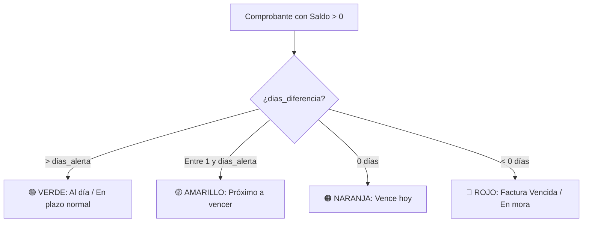

# 🔌 05. Integración con SUNAT y Motor de Alertas (Multi-Empresa)

## 1. Integración con API de Consulta SUNAT / RENIEC en Laravel

### 1.1 Objetivo
Permitir que el área contable registre rápidamente proveedores y clientes simplemente digitando el **RUC** (11 dígitos) o **DNI** (8 dígitos), autocompletando de forma fidedigna y oficial los datos desde el padrón de SUNAT.

---

### 1.2 Flujo de Consulta con Laravel HTTP Client
```
[ Frontend: JS Fetch ] ──> [ Laravel: /api/sunat/ruc/{ruc} ] ──> [ SunatService.php ]
                                                                        │
                                                                        ▼
[ Autocompleta Formulario ] <── [ JSON Response ] <─── [ Http::withToken()->get(...) ]
```

---

### 1.3 Implementación del Servicio en Laravel (`SunatService.php`)

```php
namespace App\Services;

use Illuminate\Support\Facades\Http;
use Illuminate\Support\Facades\Log;

class SunatService
{
    protected string $token;
    protected string $apiUrl;

    public function __construct()
    {
        $this->token = config('services.sunat.token', env('SUNAT_API_TOKEN', ''));
        $this->apiUrl = config('services.sunat.url', 'https://api.apis.net.pe/v2/sunat/ruc');
    }

    public function consultarRuc(string $ruc): array
    {
        try {
            $response = Http::withHeaders([
                'Authorization' => 'Bearer ' . $this->token,
                'Referer' => config('app.url')
            ])->timeout(5)->get($this->apiUrl, ['numero' => $ruc]);

            if ($response->successful()) {
                $data = $response->json();
                return [
                    'success' => true,
                    'data' => [
                        'ruc' => $data['numero'] ?? $ruc,
                        'razon_social' => $data['razonSocial'] ?? ($data['nombre'] ?? ''),
                        'estado' => $data['estado'] ?? 'ACTIVO',
                        'condicion' => $data['condicion'] ?? 'HABIDO',
                        'direccion' => $data['direccion'] ?? '',
                        'departamento' => $data['departamento'] ?? '',
                        'provincia' => $data['provincia'] ?? '',
                        'distrito' => $data['distrito'] ?? ''
                    ]
                ];
            }

            return ['success' => false, 'message' => 'RUC no encontrado en el padrón SUNAT'];
        } catch (\Exception $e) {
            Log::error("Error consultando SUNAT: " . $e->getMessage());
            return ['success' => false, 'message' => 'No se pudo conectar con el servicio SUNAT. Ingrese los datos manualmente.'];
        }
    }
}
```

#### 🛡️ Modo de Contingencia (Fallback):
Si por algún motivo la API de SUNAT está temporalmente fuera de línea o no hay internet, el sistema permite ingresar o editar la Razón Social y Dirección manualmente sin bloquear el registro.

---

## 2. Motor de Alertas y Semáforos de Vencimiento Multi-Empresa

### 2.1 Algoritmo de Cálculo de Días y Estados

Para cada comprobante que mantenga un saldo pendiente mayor a cero ($\text{saldo\_pendiente} > 0$), el sistema calcula los días de diferencia respecto a la fecha actual:

$$\text{dias\_diferencia} = \text{fecha\_vencimiento} - \text{fecha\_actual}$$



> **Nota Multi-Empresa**: Cada empresa puede configurar sus propios `dias_alerta_vencimiento` (por ejemplo, Empresa 1 = 5 días, Empresa 2 = 7 días).

### 2.2 Tabla de Clasificación de Estados y Semáforos

| Semáforo | Condición | Etiqueta en Pantalla | Acción Recomendada |
| :---: | :--- | :--- | :--- |
| 🟢 | `dias > dias_alerta` | **EN PLAZO** | Ninguna, cuenta dentro del crédito normal. |
| 🟡 | `1 <= dias <= dias_alerta` | **POR VENCER (en X días)** | Notificar a tesorería para programar pago o avisar al cliente. |
| 🟠 | `dias == 0` | **VENCE HOY** | Prioridad alta para pago o gestión de cobro hoy. |
| 🔴 | `dias < 0` | **VENCIDO (hace X días)** | Alerta crítica de morosidad o pago pendiente a proveedor. |
| ⚪ | `saldo == 0` | **PAGADO / CANCELADO** | Cuenta liquidada al 100%. |

---

## 3. Integración Directa con WhatsApp para Cobranzas (Personalizado por Empresa)

El enlace de WhatsApp inyecta automáticamente los datos de la **empresa emisora** y sus **cuentas bancarias**:

### Plantilla de Mensaje Automático:
```
Hola estimado(a) *[NOMBRE_CLIENTE]*, le saluda el área de Contabilidad de *[EMPRESA_RAZON_SOCIAL]* ([SEDE_NOMBRE]).
Le recordamos que cuenta con la factura *[NRO_COMPROBANTE]* por el concepto de *[DESCRIPCION_TRABAJO]*.

- Monto Total: S/ [MONTO_TOTAL]
- Adelanto recibido: S/ [MONTO_COBRADO]
- *Saldo Pendiente:* *S/ [SALDO_PENDIENTE]*
- Fecha de Vencimiento: *[FECHA_VENCIMIENTO]*

💳 *Cuentas Bancarias Autorizadas de [EMPRESA_NOMBRE_COMERCIAL]:*
[EMPRESA_CUENTAS_BANCARIAS]

Agradecemos coordinar la cancelación y enviar el voucher a este número. ¡Muchas gracias!
```

**Generación del Enlace:**
```javascript
const url = `https://wa.me/51${telefono}?text=${encodeURIComponent(mensaje)}`;
window.open(url, '_blank');
```
